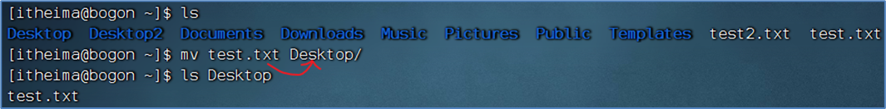
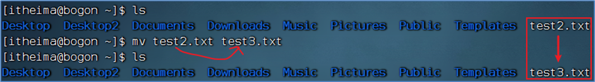
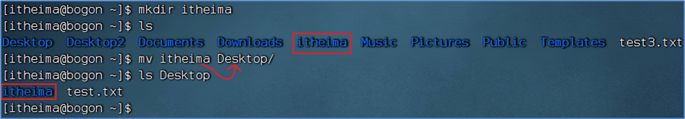

## 命令

```shell
无论是什么命令，用于什么用途，在Linux中，命令有其通用的格式：
command [-options] [paramater]

command： 命令本身
-options：[可选，非必填]命令的一些选项，可以通过选项控制命令的行为细节
parameter：[可选，非必填]命令的参数，多数用于命令的指向目标等


```


## 文件相关

### 目录、文件查看(ls)

- Linux终端（命令行）启动后默认加载HOME目录作为当前工作的目录

- HOME目录指：用户在系统内的专属目录

```shell
su -#切换成root权限


ls #列出目录下的内容

可选参数
ls [-a -l -h] [linux路径]

-a选项，表示：all的意思，即列出全部文件（包含隐藏的文件/文件夹）
以.开头的，表示是Linux系统的隐藏文件/文件夹（只要以.开头，就能自动隐藏）
只有通过-a选项，才能看到这些隐藏的文件/文件夹

-l选项，表示：以列表（竖向排列）的形式展示内容，并展示更多信息
-l选项其实和图形化中，文件夹以列表形式排列是一个意思

-h 表示以易于阅读的形式，列出文件大小，如K、M、G
-h选项必须要搭配 -l 一起使用

#上述参数可以合在一起使用 
ls -alh


```

### 目录切换(cd/pwd)

```shell
cd #命令来自英文：Change Directory


cd命令无需选项，只有参数，表示要切换到哪个目录下
cd命令直接执行，不写参数，表示回到用户的HOME目录

pwd #查看当前工作目录 Print Work Directory


```

### 相对路径与绝对路径

```shell
绝对路径：以根目录为起点，描述路径的一种写法，路径描述以/开头
相对路径：以当前目录为起点，描述路径的一种写法，路径描述无需以/开头
```

### **特殊路径符**

```shell
当前在工作目录处于：/home/yuki/Desktop

. 表示当前目录，比如 cd ./Desktop 表示切换到当前目录下的Desktop目录内，和cd Desktop效果一致

.. 表示上一级目录，比如：cd ..  即可切换到上一级目录，cd ../.. 切换到上二级的目录

~ 表示HOME目录，比如：cd ~  即可切换到HOME目录或cd ~/Desktop，切换到HOME内的Desktop目录
```


### 创建目录命令(mkdir)

```shell
通过mkdir命令可以创建新的目录（文件夹）-Make Directory
#语法
mkdir [-p] linux路径

参数必填，表示Linux路径，即要创建的文件夹的路径，相对路径或绝对路径均可
-p选项可选，表示自动创建不存在的父目录，适用于创建连续多层级的目录

创建多层级目录
mkdir -p linux路径
#mkdir -p ~/test/try/test1

快捷键：ctrl + L 等效于clear 清屏


```


## 文件操作

### 1. touch、cat、more

#### touch-创建文件

```shell
touch 创建文件

touch命令无选项，参数 必填 ，表示要创建的文件路径，相对、绝对、特殊路径符均可以使用


touch linux路径
#eg:touch ts.txt
```

#### cat-查看文件内容

```shell
cat 查看文件内容
cat同样没有选项，只有 必填 参数，参数表示：被查看的文件路径，相对、绝对、特殊路径符都可以使用

cat Linux路径
```

####more-查看文件内容

```shell
more 命令查看文件内容

more命令同样可以查看文件内容，同cat不同的是：
cat是直接将内容全部显示出来
more支持翻页，如果文件内容过多，可以一页页的展示

#eg:
more /etc/services

在查看的过程中，通过空格翻页
通过q退出查看

```

### 2. cp、mv、rm

#### 2.1 cp-创建文件

```shell
cp命令可以用于复制文件、文件夹-copy

语法：
cp [-r] 参数1 参数2
-r选项，可选，用于复制文件夹使用，表示递归
参数1，Linux路径，表示被复制的文件或文件夹 //source
参数2，Linux路径，表示要复制去的地方 //destination

#复制文件
cp text.txt ts.txt

#复制文件夹
cp -r Desktop Desktop2

复制文件夹，必须使用-r选项，否则不会生效

```

#### 2.2 mv-移动文件或文件夹

```sh
mv移动文件或文件夹 -move

语法：
mv 参数1 参数2

参数1，Linux路径，表示被移动的 文件 或 文件夹
参数2，Linux路径，表示要移动去的地方，如果目标不存在，则进行改名，确保目标存在
 
 

```

移动文件到文件夹中



这里test3.txt原本不存在,相当于进行改名了



移动文件夹到另外一个文件夹中



#### 2.3 rm-删除文件、文件夹

```shell
语法： - remove
rm [-r -f] 参数1 参数2 ..... 参数N

-r选项，可选，文件夹删除
-f选项表示force，可选，用于强制删除（不提示，一般用于root用户）

参数，表示被删除的文件或文件夹路径，支持多个，空格隔开

参数也支持通配符 *，用以做模糊匹配

- 通配符

rm 命令支持通配符 *，用来做模糊匹配
符号* 表示通配符，即匹配任意内容（包含空），示例：
test*，表示匹配任何以test开头的内容 testXXXX...
*test，表示匹配任何以test结尾的内容 XXXXX...test
*test*，表示匹配任何包含test的内容 XXXX....testXXXX.....

rm命令很危险，特别在处于root权限的时候


```


